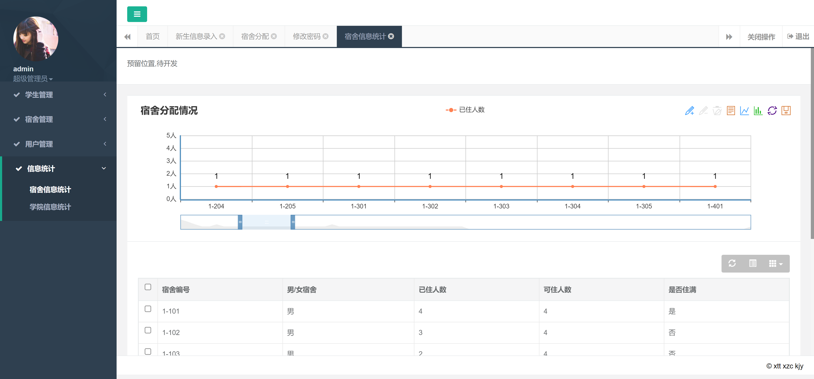

<h1 align="center">校园迎新信息管理系统</h1>

## 简介
校园迎新信息管理系统：角色分为学生、管理员；功能包括新生信息录入、宿舍分配、用户管理、信息统计与新生报到规则查看等，确保高效管理与信息处理。    --计算机毕业设计源码；毕设源码；java毕业设计源码

## 联系方式

<h3 align="center">获取完整代码与数据库文件 + 微信：deepguan QQ: 86050149 QQ群: 783742310</h3>

<h3 align="center">可帮忙远程部署 包运行成功！提供远程部署、修改代码、设计文档指导、代码讲解等服务！</h3>

## 功能介绍（完整见运行截图）
管理员：管理员可通过校园迎新信息管理系统进行登录、注册和退出。系统功能包括管理校园迎新的学生信息和宿舍分配。管理员可以在主界面录入新生信息，查看报到规则以及学生详细信息。功能模块如学生管理、宿舍管理、用户管理和信息统计等，方便管理员进行宿舍分配及信息统计，提高工作效率。

学生：学生通过系统登录界面进入校园迎新信息管理系统。系统提供新生报到功能，学生可查看报到规则、注册报到和查看宿舍分配情况。报到规则页面提供包括疫情防控要求和个人防护措施在内的入学报到注意事项，帮助学生做好入校准备。学生可以查看自己被分配到的宿舍信息以及相关的入住规则。

## 运行截图

本代码来源于网络,仅供学习参考使用!

